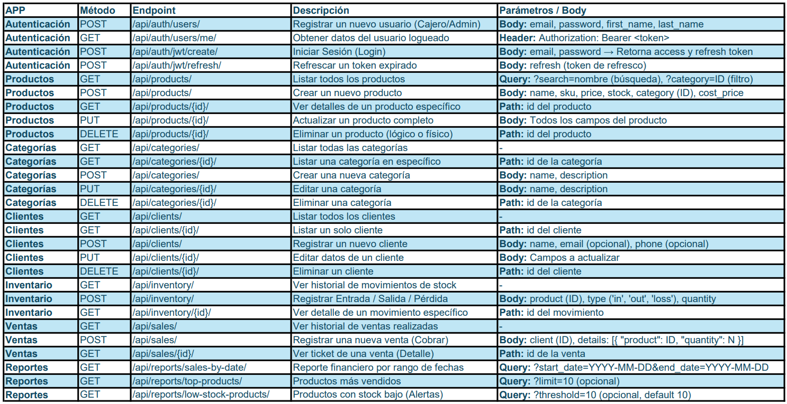

# Storehub Backend

REST API hecha en Django 4.2.25 para el proyecto de Desarrollo de Sitios Web de la Benemérita Universidad Autónoma de Puebla.

Maestro: Luis Yael Méndez Sánchez.

## Autores

- [Ulises Torres](https://www.github.com/ulisestc)
- [Alfredo Escudero](https://github.com/AlfredoRiveraaa)
- [Yuri Martínez](https://github.com/JohanYuri)
- [Joselyn Ramírez](https://github.com/josramirez29)

## Tecnologías usadas

- Django REST Framework (DRF)

- Autenticación: 
    - Djoser (Para gestión de usuarios)
    - SimpleJWT para manejo de tokens.

- [Hosting de la API en Render](https://render.com/)

- Base de datos: 
    - MySQL
    - [Hosting de la base de datos en Clever CLoud](https://www.clever.cloud/)

## Tabla de endpoints:

## Implementación de Views:

## Implementación de serializadores: