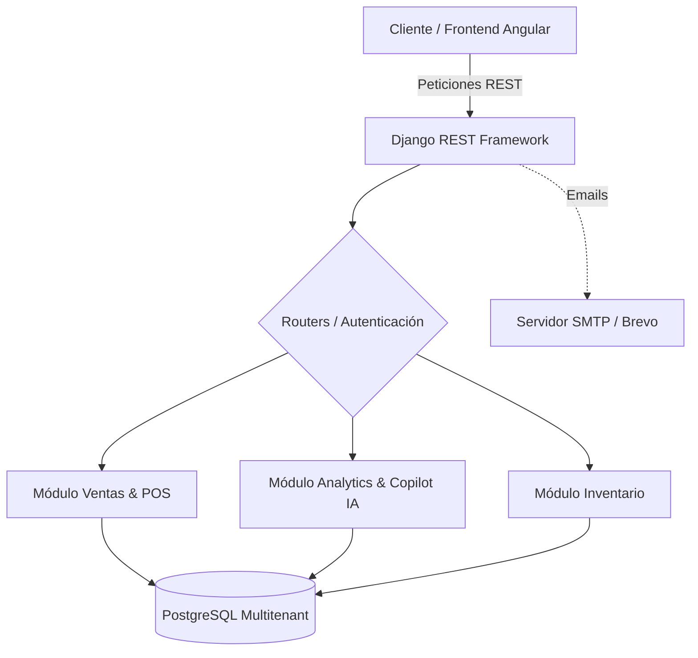

<div align="center">
  <h1>StoreHub (Backend API)</h1>
  <p><strong>REST API Core para SaaS Multitenant y Business Intelligence</strong></p>

---

**Repositorios del Proyecto:**

- [Frontend (Cliente Angular)](https://github.com/ulisestc/StoreHub)
- [Backend (API Django)](https://github.com/ulisestc/StoreHub_Backend) - *Estás aquí*

> **Proyecto destacado para la Feria de Proyectos 2026**
> Facultad de Ciencias de la Computación, Benemérita Universidad Autónoma de Puebla (BUAP).
> *Bajo la tutela del Mtro. Luis Yael Méndez Sánchez.*

---

## Contexto e Impacto Social

En México, y específicamente en Puebla, la mayoría de los pequeños negocios operan desde la informalidad administrativa. Sin datos financieros confiables, estas microempresas no pueden crecer ni acceder a créditos bancarios, dejando a sus empleados atrapados en la precariedad.

**StoreHub** se alinea con el **Objetivo de Desarrollo Sostenible (ODS) 8: Trabajo Decente y Crecimiento Económico**, proveyendo la infraestructura digital, base de datos y endpoints necesarios para que cualquier comerciante registre ventas, analice datos y genere un historial financiero sólido, de forma gratuita y escalable.

---

## Arquitectura y Capacidades Core

Este repositorio contiene el "cerebro" detrás de la plataforma, desarrollado en **Django REST Framework** sobre **PostgreSQL**:

- **Arquitectura Multitenant:** Una sola base de datos central, múltiples negocios operando en simultáneo. Acceso restringido a nivel consulta para garantizar que ninguna tienda pueda ver los datos de otra.
- **Seguridad (RBAC y JWT):** Autenticación mediante JSON Web Tokens. Los permisos (Vendedor vs Administrador) se procesan estrictamente antes de cada transacción.
- **Inteligencia de Negocio (BI):** Integración nativa de algoritmos estadísticos (como el *Algoritmo Apriori* para Market Basket) para predecir productos complementarios en tiempo real y calcular inventarios de seguridad.
- **Notificaciones Asíncronas:** Envío automatizado de tickets de compra y alertas de stock bajo mediante SMTP/Brevo.



---

## Guía de Instalación Rápida

Para asegurar consistencia total en cualquier sistema operativo, este proyecto está completamente contenerizado usando **Docker**. No requieres instalar Python ni PostgreSQL localmente.

### 1. Preparar el Entorno

```bash
git clone https://github.com/ulisestc/StoreHub_Backend.git
cd StoreHub_Backend
# Copiar plantilla de variables de entorno
cp .env.example .env
```

### 2. Levantar la Infraestructura

Inicia los servicios, la base de datos y el servidor local de correos con un solo comando:

```bash
docker compose up --build
```

**Servicios Activos:**

- **API REST Principal:** [http://localhost:8000/api/](http://localhost:8000/api/)
- **Buzón Local (SMTP4Dev):** [http://localhost:5000](http://localhost:5000)

### 3. Cargar Datos Semilla

Para probar la plataforma, puedes generar una base de datos de prueba (tiendas, inventarios, y un histórico de 3 meses de ventas):

```bash
docker compose exec backend python manage.py seed_data
```

**Cuentas generadas para pruebas:**

- *Administrador:* `admin@storehub.com` / `admin12345`
- *Cajero:* `vendedor@storehub.com` / `seller12345`

---

## Documentación API

Toda la documentación interactiva (OpenAPI/Swagger) se genera automáticamente según los endpoints expuestos:

- **Swagger UI:** [http://localhost:8000/api/docs/](http://localhost:8000/api/docs/)

### Comandos de Desarrollo

```bash
# Aplicar migraciones
docker compose exec backend python manage.py makemigrations
docker compose exec backend python manage.py migrate

# Correr Pruebas Unitarias Automáticas
docker compose exec backend python manage.py test
```

---

## Equipo Elaborador

- **Aaron Ulises Torres Corte**
- **Alfredo Escudero Rivera**
- **Johan Yuri Martínez García**
- **Joselyn Ramírez Lima**

---

<div align="center">
  <sub>Desarrollado con alto estándar arquitectónico para escalabilidad real.</sub>
</div>
